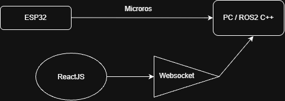

<div align="center">

# 🤖 Pioneer-X | Autonomous Differential Drive Robot

### A full-stack robotics project — from Electronics to real-time control dashboards

**Mechanical design · Electronics · Embedded firmware · ROS 2 · Control Algorithms · Custom SCADA (React)**

<!-- 🖼️ PLACEHOLDER: Replace with your best hero shot / GIF of the robot moving, ideally with the SCADA dashboard side by side -->


[](#)
[](#)
[](#)
[](#-license)
[](#)

<!-- 🖼️ PLACEHOLDER: Add more badges if relevant — e.g. Docker, KiCad, Fusion360, micro-ROS, Node version -->

</div>

---

## 📌 About this project

This is a **fully built, working, from-scratch differential-drive mobile robot**, inspired by the classic Pioneer research platforms — but extended into a complete robotics stack that could be upgraded any time.

This repository is **not a tutorial**. It is a **portfolio**: the complete set of design files, source code, firmware, and control software behind a robot that physically exists, drives, localizes itself, and can be commanded and monitored in real time through a custom web-based SCADA I built in React.

> ⚠️ *This is proof-of-work documentation. Build instructions, BOM sourcing tips, and step-by-step guides are intentionally out of scope — the goal is to showcase the integrated system as it currently stands.*

### 🚧 Status: Active Development

This project is **not a closed, finished product** — it's designed and built as an **open testbed platform**. The mechanical structure, electronics, firmware, and ROS 2 architecture were all built with extensibility as a first-class goal:

- 🧩 **New control/path-tracking algorithms** can be dropped in as independent ROS 2 nodes and selected live from the SCADA, without touching the rest of the stack.
- 🔌 **New hardware accessories** (sensors, actuators, additional boards) can be integrated thanks to the modular electronics layout and the firmware/ROS 2 separation of concerns.
- 🧪 The whole point of the SCADA is to make this platform easy to **test, compare, and iterate on** — swap an algorithm, watch the telemetry, tune it, repeat.

In short: this repo is a living platform for experimenting with mobile robot control and hardware, not a one-off build. Expect ongoing commits, new algorithms, and new accessories over time — see the [Roadmap](#-roadmap).

<!-- ✍️ DEVELOP MORE: 1-2 paragraphs here about WHY you built this — personal motivation, what gap you wanted to fill, what you wanted to learn/prove (control theory? full-stack robotics? SCADA/HMI design? building an extensible research platform?). This is the part recruiters/visitors read first. -->

---

## 🎥 Demonstrations

<!-- 🖼️ PLACEHOLDER: This section sells the project. Embed real GIFs/videos. GitHub renders GIFs inline; for longer videos, link to YouTube with a thumbnail. -->

| Autonomous navigation | Real-time SCADA monitoring | Manual teleoperation |
|---|---|---|
|  |  |  |

<!-- ✍️ DEVELOP MORE: Add a "Full demo video" section here with a YouTube/Drive link, ideally 2-4 minutes showing: boot-up, teleop, autonomous path-following with each algorithm, and the SCADA reacting live. -->

---

## 🧭 Table of Contents

- [System Overview](#-system-overview)
- [Hardware](#-hardware)
- [Electronics & Wiring](#-electronics--wiring)
- [Firmware (ESP32)](#-firmware-esp32)
- [ROS 2 Software Stack](#-ros-2-software-stack)
- [Control & Path-Tracking Algorithms](#-control--path-tracking-algorithms)
- [SCADA / Web HMI (React)](#-scada--web-hmi-react)
- [Localization](#-localization)
- [Repository Structure](#-repository-structure)
- [Tech Stack Summary](#-tech-stack-summary)
- [Results & Performance](#-results--performance)
- [Roadmap](#-roadmap)
- [License](#-license)
- [Author](#-author)

---

## 🏗️ System Overview

<!-- 🖼️ PLACEHOLDER: High-level architecture diagram — boxes for ESP32 <-> micro-ROS/serial <-> ROS2 (Nav stack, controllers, EKF) <-> rosbridge/WebSocket <-> React SCADA. Draw it in draw.io/excalidraw and export as PNG/SVG into docs/media/ -->



The robot is organized into three integrated layers:

| Layer | Responsibility | Tech |
|---|---|---|
| **Low-level control** | Motor driving, encoder reading, PID velocity loops, sensor interfacing | ESP32 (C/C++) |
| **High-level autonomy** | Localization, path planning, trajectory tracking, control algorithms | ROS 2 |
| **Supervision (SCADA)** | Real-time visualization, teleoperation, algorithm selection, telemetry | React + WebSocket/rosbridge |

<!-- ✍️ DEVELOP MORE: Describe the communication pipeline in detail — e.g. "ESP32 publishes wheel odometry over serial/micro-ROS at X Hz, ROS2 fuses it with IMU via robot_localization EKF, Nav2/custom controller node computes cmd_vel, rosbridge_server exposes topics over WebSocket, React subscribes via roslibjs." -->

---

## ⚙️ Hardware

<!-- 🖼️ PLACEHOLDER: CAD renders — exploded view, chassis, wheel assembly, top view with dimensions -->

<p align="center">
  
  
  
</p>

- **Chassis:** custom-designed, differential drive, [material/manufacturing — 3D printed]
- **Drive:** 2x DC gear motors + encoders, L298 Driver.
- **CAD files:** provided in [`/hardware/cad`](./hardware/cad) (STEP, native format, and STL for printing)

📄 **Full Bill of Materials:** [`/hardware/BOM.xlsx`](./hardware/BOM.xlsx)

<!-- ✍️ DEVELOP MORE: Table with key specs — dimensions, weight, wheel diameter, wheelbase, max speed, battery/autonomy, payload, sensor list (LiDAR? camera? IMU? ultrasonic?). This is important for anyone evaluating the robot's real capabilities. -->

| Spec | Value |
|---|---|
| Dimensions (L×W×H) | TBD |
| Weight | TBD |
| Wheelbase | TBD |
| Wheel diameter | TBD |
| Max linear speed | TBD |
| Sensors onboard | TBD |
| Battery / autonomy | TBD |
| Compute onboard | TBD |

---

## 🔌 Electronics & Wiring

<!-- 🖼️ PLACEHOLDER: Full wiring/connection diagram (Fritzing, KiCad schematic, or hand-drawn and cleaned up), plus a photo of the real wiring inside the chassis -->


- Full schematic: [`/hardware/electronics/schematic.pdf`](./hardware/electronics)
- Component datasheets: [`/hardware/electronics/datasheets`](./hardware/electronics/datasheets)

<!-- ✍️ DEVELOP MORE: List the main components (motor driver model, ESP32 dev board, encoders type, power distribution/voltage regulation, any sensors) and explain any non-obvious design decisions (e.g. why you chose that motor driver, isolation, current sensing, etc.) -->

---

## 💾 Firmware (ESP32)

Location: [`/firmware`](./firmware)

The ESP32 handles the real-time, deterministic parts of the robot:

- PWM motor control + direction
- Quadrature encoder reading (interrupt-driven)
- Closed-loop wheel velocity control (PID)
- Differential drive kinematics (cmd_vel → wheel speeds)
- Odometry computation
- Communication with the ROS 2 side (serial / micro-ROS / WiFi — *specify which*)

<!-- ✍️ DEVELOP MORE: Specify the exact communication method with ROS2 (micro-ROS agent? rosserial? custom serial protocol over UART? WiFi/UDP?), control loop frequency, PID tuning approach, and any safety features (watchdog, e-stop, timeout on cmd_vel). -->

```
firmware/
├── src/
├── include/
├── platformio.ini   (or .ino if Arduino IDE)
└── README.md        → firmware-specific notes
```

---

## 🐢 ROS 2 Software Stack

Location: [`/ros2_ws/src`](./ros2_ws/src)

<!-- 🖼️ PLACEHOLDER: rqt_graph screenshot showing your actual node/topic graph -->


Custom ROS 2 packages built for this robot. The architecture keeps control algorithms and hardware interfaces decoupled into their own packages/nodes, so new ones can be added without modifying the core stack:

| Package | Purpose |
|---|---|
| `pioneer_driver` | Serial/micro-ROS bridge to the ESP32, publishes odom, subscribes to cmd_vel |
| `pioneer_control` | Path-tracking controllers (MPC, Follow the Carrot, etc.) |
| `pioneer_localization` | Sensor fusion / localization node(s) |
| `pioneer_bringup` | Launch files, parameter configs |
| `pioneer_bridge` | rosbridge/WebSocket interface exposed to the SCADA |

<!-- ✍️ DEVELOP MORE: Adjust package names/table to your actual repo. Mention if you use Nav2, robot_localization, or fully custom nodes. Mention simulation support if you have a Gazebo/Ignition model of the robot. -->

---

## 🎯 Control & Path-Tracking Algorithms

One of the standout features of this project: the robot supports **multiple, hot-swappable trajectory-tracking algorithms**, selectable live from the SCADA.

| Algorithm | Description | Status |
|---|---|---|
| **Follow the Carrot** | Classic pursuit of a moving lookahead point on the path | ✅ Implemented |
| **MPC (Model Predictive Control)** | Optimization-based control over a prediction horizon | ✅ Implemented |
| **Pure Pursuit** | *(if implemented)* | 🔲 |
| **PID path following** | *(if implemented)* | 🔲 |

<!-- ✍️ DEVELOP MORE: This is your strongest technical differentiator — expand heavily here.
For EACH algorithm, add:
- Short explanation of the math/approach used
- Key tunable parameters (lookahead distance, horizon length, weights, constraints)
- A GIF/plot comparing behavior (e.g. tracking error over time) between algorithms on the same path
- Why you chose to implement each one / what you learned
Consider linking to a `/docs/control_theory.md` or similar for the deep technical writeup, and keeping this section as a summary. -->

<p align="center">
  
</p>

*<!-- 🖼️ PLACEHOLDER: plot comparing cross-track error of the algorithms, generated from rosbag data -->*

---

## 🖥️ SCADA / Web HMI (React)

Location: [`/scada`](./scada)

<!-- 🖼️ PLACEHOLDER: Screenshot or GIF of the dashboard — ideally a few, showing: live map/localization, telemetry panel, algorithm selector, manual command panel -->


A custom-built, real-time supervisory dashboard, developed entirely in React, that connects directly to the ROS 2 stack:

- 📍 **Real-time localization view** — live robot pose over the map/path
- 🎮 **Manual command interface** — teleoperation, direct velocity commands
- 🔀 **Algorithm selector** — switch between MPC / Follow the Carrot / others on the fly
- 📊 **Live telemetry** — velocities, battery, control errors, system status
- 🛑 **Safety controls** — *(e-stop, connection status, etc. — specify)*

**Stack:** React, [state management — Redux/Zustand/Context], [charting — Recharts/D3/Plotly], [ROS bridge — roslibjs + rosbridge_suite / custom WebSocket server]

<!-- ✍️ DEVELOP MORE: This is a major selling point — most portfolio robots don't have a custom SCADA. Expand with:
- Architecture diagram of how React talks to ROS2 (rosbridge_suite? custom Node.js/Python WebSocket bridge?)
- Screenshots of every major view/panel
- A short GIF of switching algorithms live and seeing the robot's behavior change
- Any interesting frontend engineering choices (canvas/SVG rendering of the map, performance considerations for real-time data, etc.) -->

```
scada/
├── src/
│   ├── components/
│   ├── hooks/
│   ├── services/       → ROS/WebSocket connection layer
│   └── pages/
├── public/
└── package.json
```

---

## 📡 Localization

<!-- ✍️ DEVELOP MORE: Explain how the robot knows where it is. Options to describe:
- Wheel odometry only?
- Fused with IMU via EKF (robot_localization)?
- LiDAR-based (AMCL / SLAM)?
- Any external reference (motion capture, markers)?
Include an accuracy discussion / drift characterization if you have data (e.g. "drift of X cm over Y meters"). -->

<!-- 🖼️ PLACEHOLDER: Plot of estimated trajectory vs ground truth / vs commanded path -->


---

## 📂 Repository Structure

```
pioneer-x/
├── hardware/
│   ├── cad/                  # STEP / native CAD + STL files
│   ├── electronics/
│   │   ├── schematic.pdf
│   │   └── datasheets/
│   └── BOM.xlsx
│
├── firmware/                 # ESP32 low-level control code
│   ├── src/
│   ├── include/
│   └── platformio.ini
│
├── ros2_ws/
│   └── src/
│       ├── pioneer_driver/
│       ├── pioneer_control/       # MPC, Follow the Carrot, etc.
│       ├── pioneer_localization/
│       ├── pioneer_bridge/        # rosbridge / WebSocket layer
│       └── pioneer_bringup/       # launch files, configs
│
├── scada/                    # React real-time dashboard
│   ├── src/
│   └── public/
│
├── docs/
│   ├── media/                 # images, gifs, diagrams for this README
│   ├── architecture.md        # (optional deep-dive doc)
│   └── control_theory.md      # (optional deep-dive doc)
│
├── LICENSE
└── README.md
```

<!-- ✍️ DEVELOP MORE: Adjust this tree to match your ACTUAL folder names exactly before publishing — this must mirror the real repo 1:1. -->

---

## 🧰 Tech Stack Summary

<div align="center">


</div>

<!-- ✍️ DEVELOP MORE: Trim/adjust to your actual tools (which CAD software, which PCB tool if any, which specific ROS2 distro, which charting lib in React, etc.) -->

---

## 📈 Results & Performance

<!-- ✍️ DEVELOP MORE: This section turns the project from "cool" into "credible." Include hard numbers if you have them, e.g.:
- Tracking error (mean/max cross-track error) per algorithm
- Control loop frequency achieved
- Localization drift over distance/time
- Battery life / operating autonomy
- Max speed achieved reliably
- Latency of the SCADA (command sent → robot reacts)
Use a table + at least one plot generated from real logged data (rosbag / CSV export). -->

| Metric | Value |
|---|---|
| Control loop frequency | TBD |
| Mean cross-track error (MPC) | TBD |
| Mean cross-track error (Follow the Carrot) | TBD |
| Localization drift | TBD |
| SCADA end-to-end latency | TBD |

---

## 🗺️ Roadmap

<!-- ✍️ DEVELOP MORE: List what's next — shows the project is alive and you have vision beyond "finished." e.g.: -->

- [ ] SLAM-based mapping support
- [ ] Multi-robot fleet view in SCADA
- [ ] Obstacle avoidance layer
- [ ] Dockerized ROS 2 + SCADA deployment
- [ ] Simulation environment (Gazebo/Ignition digital twin)

---

## 📄 License

This project is licensed under the [MIT License](./LICENSE) — feel free to reference or learn from it; attribution appreciated.

<!-- ✍️ Confirm this matches your actual chosen license (MIT / Apache-2.0 / GPL, etc.) and add the LICENSE file to the repo root. -->

---

## 👤 Author

**Jose Segura Montes**
Robotics / Mechatronics engineer

<!-- ✍️ DEVELOP MORE: Add links — LinkedIn, personal site, email, other projects -->

[](www.linkedin.com/in/jose-segura-montes)
[](https://portfolio-github-8fqt.vercel.app)

<div align="center">

*Built with ⚙️ hardware, 🧠 control theory, and 💻 a lot of debugging.*

</div>
